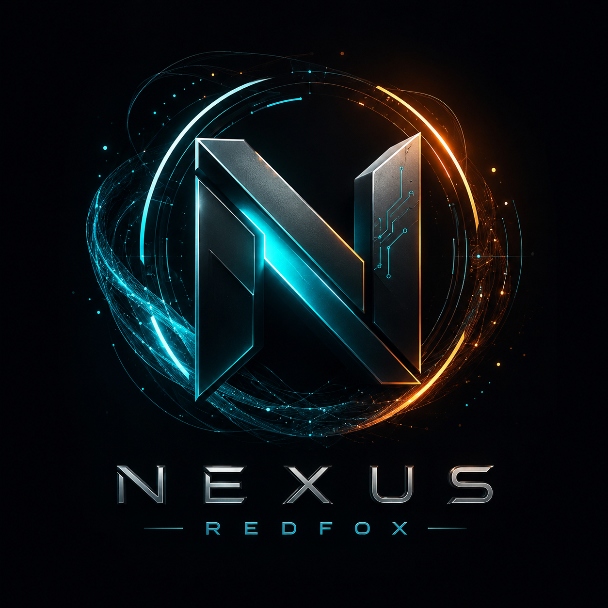

[🇬🇧 English](README.md) • [🇮🇷 فارسی](README_FA.md)

# NEXUS REDFOX

  

<h1 align="center">NEXUS REDFOX</h1>

  <strong>Local-First Codebase Intelligence, Security Analysis & Developer Security Workspace</strong>

  <a href="https://github.com/shanduzgil/nexus-redfox">GitHub</a>
  ·
  <a href="https://github.com/shanduzgil/nexus-redfox/issues">Issues</a>
  ·
  <a href="SECURITY.md">Security Policy</a>
  ·
  <a href="LICENSE">License</a>

  <em>Understand your codebase. Map its architecture. Detect security risks. Inspect dependencies. Verify integrity. Keep the entire workflow local.</em>

---

📖 Overview

NEXUS REDFOX 0.2.0 is a local-first codebase intelligence and security workspace designed to help developers, security engineers, researchers, maintainers, and DevSecOps teams understand and inspect software projects from a single tool.

NEXUS combines several capabilities that are normally scattered across different utilities:

- 🔐 Deterministic security scanning
- 🧠 Codebase and architecture intelligence
- 🕸️ Dependency and import graph generation
- 🔎 Symbol and path search
- 🎯 Impact analysis and reverse traversal
- 📦 Software Bill of Materials (SBOM) generation
- 🧾 SHA-256 project manifests and integrity verification
- 📦 Portable analysis capsules
- 📊 JSON, HTML, and SARIF reporting
- 🤖 Optional local AI analysis through Ollama
- 🔌 MCP-compatible inspection server
- 🌐 Offline local web dashboard
- 🛠️ Git repository inspection
- 🩺 Environment and project diagnostics

The project is intentionally designed around a local-first operating model. The deterministic analysis engine does not require a cloud API, repository source code is read locally, and the default web dashboard binds to "127.0.0.1".

«Important: NEXUS REDFOX is an analysis and defensive security tool. Its purpose is to inspect software projects, identify security-relevant patterns, understand architecture, and produce structured reports. It is not an exploit framework.»

---

✨ Features

🔐 Security Scanner

NEXUS performs deterministic static security analysis against the source tree using its bundled rule pack.

The scanner can identify security-relevant patterns such as:

- hard-coded secrets and credentials
- cloud access keys
- private keys
- authentication tokens
- dangerous command execution patterns
- unsafe dynamic evaluation
- insecure deserialization patterns
- weak cryptographic usage
- TLS verification issues
- unsafe SQL construction
- insecure workflow configurations
- other rule-defined security weaknesses

The rule engine supports severity levels including:

Critical
High
Medium
Low
Info

The scanner can run in normal or deep mode:

nexus scan .

nexus scan . --deep

You can also make a scan return a failing process status when high or critical findings exist:

nexus scan . --fail-on-high

---

🧠 Codebase Intelligence

NEXUS does more than scan files.

It builds a structured understanding of the repository by extracting information such as:

- files
- paths
- symbols
- classes
- functions
- methods
- imports
- relationships between project components

This information can then be searched, exported, traversed, and used as context for other NEXUS capabilities.

---

🕸️ Architecture Graph

The graph engine transforms the codebase into an architecture-oriented graph.

A simplified representation looks like:

Application
│
├── authentication
│   ├── login()
│   └── session()
│
├── database
│   ├── connect()
│   └── query()
│
└── API
    ├── routes
    └── handlers

NEXUS stores this information as graph nodes and relationships.

Generate a graph:

nexus graph .

Write the graph to a file:

nexus graph . --out nexus-graph.json

The graph can then be consumed by scripts, analysis tooling, dashboards, or downstream automation.

---

🎯 Impact Analysis

Impact analysis allows you to search the architecture graph for a symbol, path, or node and trace affected upstream components.

Example:

nexus impact authentication .

This can help answer questions such as:

- Which parts of the project depend on a component?
- What files are connected to a symbol?
- Which parts of the architecture may be affected by a change?
- Where is a particular capability referenced?

The result is returned as structured JSON containing matching nodes and affected nodes.

---

🔎 Code Search

NEXUS contains a local project index that can be queried by symbol or path.

Example:

nexus search login .

The result contains structured information such as:

id
kind
name
path
line

This makes it possible to search the project without manually browsing the entire repository.

---

⚡ Incremental Project Index

NEXUS maintains a SQLite index inside:

.nexus/index.db

The index stores information derived from project files and uses file metadata and hashes to avoid unnecessary repeated work.

Typical workflow:

nexus init .
nexus index .

After the index exists, repeated indexing can focus on changed files instead of treating the entire repository as a completely new project.

---

📦 Software Bill of Materials (SBOM)

NEXUS can inspect common package/dependency manifests and generate SBOM information in two widely used formats:

- SPDX
- CycloneDX

Generate an SBOM:

nexus sbom .

Save the result:

nexus sbom . --out sbom.json

The generated output contains both SPDX-style and CycloneDX-style data.

This is useful for:

- dependency inventory
- software supply-chain visibility
- release documentation
- security review
- compliance workflows
- dependency analysis

---

🧾 Project Snapshots & Integrity Verification

NEXUS can create a project manifest containing file integrity information.

Create a snapshot:

nexus snapshot .

By default, the snapshot is written to:

.nexus/snapshot.json

You can also specify a custom output path:

nexus snapshot . --out release-manifest.json

The manifest records file-level integrity information based on SHA-256 hashes.

To verify a project against a previously generated manifest:

nexus verify .nexus/snapshot.json .

The command returns structured JSON indicating whether the project matches the recorded manifest.

This makes snapshots useful for:

- integrity verification
- release checks
- reproducibility workflows
- detecting unexpected file modifications

---

📦 Portable Analysis Capsules

A NEXUS Capsule is a portable ZIP package containing analysis artifacts generated from a project.

Create a capsule:

nexus capsule .

Specify the output:

nexus capsule . --out nexus-analysis.nexus.zip

A capsule can contain analysis information such as:

- security scan findings
- architecture graph data
- SBOM information
- manifest information
- release metadata
- SHA-256 checksums

To include project source files as part of the capsule:

nexus capsule . --include-source

For a deeper scan during capsule generation:

nexus capsule . --deep

You can combine these options:

nexus capsule . --include-source --deep --out nexus-analysis.nexus.zip

---

✅ Capsule Verification

Capsules contain checksums that can be verified later.

Run:

nexus capsule-verify nexus-analysis.nexus.zip

The command verifies the capsule contents against the embedded checksum information.

This is useful when moving analysis artifacts between systems or preserving an auditable analysis package.

---

📊 Security Reports

NEXUS supports multiple report formats.

HTML

Generate a browser-friendly report:

nexus scan . --format html --out nexus-report.html

The HTML report is convenient for:

- manual review
- security assessments
- sharing findings internally
- quick visual inspection

JSON

Generate structured machine-readable output:

nexus scan . --format json --out nexus-report.json

JSON is useful for scripts and custom integrations.

SARIF

Generate SARIF output:

nexus scan . --format sarif --out nexus.sarif.json

SARIF is designed for interoperability with security tooling and code-scanning workflows.

Example:

nexus scan . --deep --format sarif --out nexus.sarif.json

---

🌐 Local Web Dashboard

NEXUS includes a lightweight local web dashboard.

Start it with:

nexus serve .

The default address is:

http://127.0.0.1:8765

The dashboard provides a local interface for interacting with project analysis data.

It exposes project-oriented views and API routes for capabilities such as:

- security findings
- architecture data
- SBOM information
- project search

The default server binds to loopback for local-only operation.

---

🌍 Allowing Remote Access

Remote dashboard access is not enabled by default.

If you explicitly need the server to listen beyond loopback:

nexus serve . --host 0.0.0.0 --port 8765 --allow-remote

Only enable remote access when you understand the network exposure and have appropriate access controls in place.

For normal local usage, keep the default:

nexus serve .

---

🤖 Local AI with Ollama

NEXUS can optionally use a local Ollama instance for natural-language analysis.

The default NEXUS configuration uses:

Endpoint: http://127.0.0.1:11434
Model:    qwen2.5-coder:7b

The "qwen2.5-coder:7b" model is available through Ollama's official model library.

1. Install Ollama

Install Ollama for your operating system using the official Ollama distribution.

After installation, verify that Ollama is available.

2. Pull the default model

ollama pull qwen2.5-coder:7b

You can also test the model directly:

ollama run qwen2.5-coder:7b

3. Ask NEXUS a project question

From the root of the project:

nexus ask "Explain the authentication flow" .

You can ask questions such as:

nexus ask "Explain the architecture of this project" .

nexus ask "Where are the main security-sensitive components?" .

nexus ask "Which components appear to depend on the authentication subsystem?" .

NEXUS prepares project-derived context for the request and sends the selected information to the configured local AI endpoint.

By default, this endpoint is local:

127.0.0.1:11434

---

⚙️ Custom AI Model or Endpoint

You can override the model:

nexus ask "Explain the project" . --model qwen2.5-coder:7b

You can override the endpoint:

nexus ask "Explain the project" . --url http://127.0.0.1:11434

You can change the request timeout:

nexus ask "Explain the project" . --timeout 300

For non-local AI endpoints, explicit remote access opt-in is required:

nexus ask "Explain the project" . --url http://your-server:11434 --allow-remote

Use remote endpoints only when you intentionally want project information to leave the local machine.

---

🔌 MCP Server

NEXUS includes an MCP-compatible server so compatible AI tooling can access project-inspection capabilities.

Start the MCP server:

nexus mcp .

The MCP interface is intended for read-oriented project intelligence and exposes NEXUS capabilities to compatible MCP clients.

This makes it possible to place NEXUS between an AI assistant and a codebase so the assistant can obtain structured information about:

- security findings
- project architecture
- code relationships
- symbols
- dependencies
- remediation information

---

🧾 Security Rule Explanation

NEXUS includes a local remediation and security knowledge base.

To explain a rule:

nexus explain NXS101

This provides the information associated with that rule, including its documented context and remediation guidance when available.

This is especially useful when a scan reports a finding and you want to understand what the rule represents before reviewing the affected code.

---

🩺 Doctor

The "doctor" command provides project and environment diagnostics.

Run:

nexus doctor .

The command reports information such as:

- Python version
- whether the project is a Git repository
- whether Ollama is reachable
- graph statistics

This is a useful first step when troubleshooting a local setup.

---

🌿 Git Summary

NEXUS can inspect the Git state of a repository.

Run:

nexus git-summary .

The command can expose repository state useful for analysis workflows, including branch/commit-related information and whether the working tree is clean.

---

🚀 Installation

NEXUS REDFOX requires:

- Python 3.11 or newer
- Windows, macOS, or Linux
- Git if you want to clone the repository
- Ollama only if you want local AI features

The core package is pure Python and is designed for the three major desktop/server platform families. Native mobile operating systems are not claimed as supported targets.

---

🐍 Method 1 — Install from the GitHub Repository

Clone the repository:

git clone https://github.com/shanduzgil/nexus-redfox.git

Enter the project directory:

cd nexus-redfox

Create a virtual environment:

Linux / macOS

python3 -m venv .venv
source .venv/bin/activate

Windows PowerShell

py -3.11 -m venv .venv
.venv\Scripts\Activate.ps1

Windows Command Prompt

py -3.11 -m venv .venv
.venv\Scripts\activate.bat

Install NEXUS:

python -m pip install --upgrade pip
python -m pip install .

Verify the installation:

nexus --version

You should see the installed NEXUS version information.

---

⚡ Method 2 — Install the Built Wheel

The repository release package may contain a wheel under:

dist/

From the project root:

python -m pip install dist/nexus_redfox-0.2.0-py3-none-any.whl

Then:

nexus --version

---

🛠️ Development Installation

If you are developing NEXUS itself, clone the repository and install it in editable mode:

git clone https://github.com/shanduzgil/nexus-redfox.git
cd nexus-redfox

Create and activate a virtual environment, then:

python -m pip install -e .

Now changes made inside the source tree are reflected directly in the installed "nexus" command.

---

🪟 Windows Helper Scripts

The repository also contains helper scripts for Windows and Unix-like systems:

nexus.bat
nexus.ps1
nexus.sh

These are provided as convenience launchers around the project.

The standard Python installation method remains the recommended cross-platform setup.

---

🐳 Docker

NEXUS also includes a Dockerfile and Compose configuration.

Build the image:

docker build -t nexus-redfox .

Run it:

docker run --rm -p 8765:8765 nexus-redfox

The container starts the web dashboard and exposes port:

8765

The bundled Compose configuration also uses container hardening options such as:

- read-only filesystem
- temporary writable "/tmp"
- "no-new-privileges"

Start with Compose:

docker compose up --build

Then open:

http://127.0.0.1:8765

---

🧭 First-Time Setup

After installation, initialize a project:

cd /path/to/your-project
nexus init .

This creates:

.nexus/
└── config.json

The configuration contains values such as:

- maximum file size
- hidden-file behavior
- ignored paths
- worker configuration
- Ollama endpoint
- AI model
- AI timeout
- remote-agent policy
- scan mode

---

🔥 Recommended First Workflow

For a new codebase, a good starting workflow is:

nexus init .

Then build the project index:

nexus index .

Run a security scan:

nexus scan . --format html --out nexus-report.html

Generate the architecture graph:

nexus graph . --out nexus-graph.json

Generate an SBOM:

nexus sbom . --out sbom.json

Create a project snapshot:

nexus snapshot .

Then verify the snapshot later:

nexus verify .nexus/snapshot.json .

Finally, create a portable analysis capsule:

nexus capsule . --out nexus-analysis.nexus.zip

---

🧪 Deep Security Analysis

For a more extensive rule evaluation, use:

nexus scan . --deep --format html --out nexus-deep-report.html

For SARIF:

nexus scan . --deep --format sarif --out nexus-deep.sarif.json

For CI-style behavior where high or critical findings should cause a non-zero exit status:

nexus scan . --deep --fail-on-high

---

🗂️ What NEXUS Creates

A typical analyzed project can contain:

your-project/
│
├── .nexus/
│   ├── config.json
│   ├── index.db
│   └── snapshot.json
│
├── nexus-report.html
├── nexus-graph.json
├── sbom.json
└── nexus-analysis.nexus.zip

These files are generated according to the commands you execute.

The ".nexus/" directory is the local workspace used by NEXUS for project configuration, indexing, and snapshots.

---

🔒 Local-First Security Model

One of the central design goals of NEXUS is to keep deterministic analysis local.

The core workflow does not require a cloud API for:

- scanning
- graph generation
- indexing
- search
- impact analysis
- SBOM generation
- manifest generation
- capsule generation

NEXUS reads project files locally.

The default dashboard binds to:

127.0.0.1

The default AI endpoint is also local:

127.0.0.1:11434

Remote dashboard and remote AI use require explicit opt-in flags.

---

🚫 Repository Code Is Not Executed by the Core Analysis Workflow

NEXUS is designed to inspect repository contents rather than execute the analyzed repository during:

scan
graph
sbom
capsule

operations.

This makes the core workflow suitable for analyzing source trees without requiring the repository itself to run.

---

🧩 Supported Analysis Ecosystem

NEXUS contains language and file-handling logic for a broad range of software ecosystems, including languages and formats such as:

Python
JavaScript
TypeScript
Java
Kotlin
Go
Rust
Ruby
PHP
C
C++
C#
Swift
Scala
Shell
SQL
HTML
CSS
JSON
YAML
TOML
XML
Gradle
Properties

It also recognizes common project files and build/dependency manifests.

Support is implemented according to the analysis logic shipped with the current release.

---

🏗️ Project Architecture

At a high level, NEXUS is organized into several logical layers:

                    ┌───────────────────────┐
                    │       NEXUS CLI       │
                    └───────────┬───────────┘
                                │
        ┌───────────────────────┼────────────────────────┐
        │                       │                        │
        ▼                       ▼                        ▼
   Security Scanner        Code Graph               Indexer
        │                       │                        │
        ▼                       ▼                        ▼
     Findings              Architecture               SQLite
        │                   Relationships              Index
        │
        ├──────────────┐
        ▼              ▼
      Reports         CWE / Remediation
        │
        ├── JSON
        ├── HTML
        └── SARIF

        ┌─────────────────────────────────────────┐
        │              Other Engines              │
        ├─────────────────────────────────────────┤
        │ SBOM │ Manifest │ Capsule │ Git │ MCP  │
        └─────────────────────────────────────────┘
                           │
                  ┌────────┴────────┐
                  ▼                 ▼
             Web Dashboard       Local AI
                                  Ollama

The implementation is primarily pure Python with static web assets for the dashboard.

---

🔬 Analysis Pipeline

A simplified NEXUS workflow looks like:

Repository
    │
    ▼
File Discovery
    │
    ├──────────────► Security Scanner ─────► Findings
    │
    ├──────────────► Symbol Extraction ────► Index
    │
    ├──────────────► Import Analysis ──────► Graph
    │
    ├──────────────► Dependency Parsing ───► SBOM
    │
    └──────────────► File Hashing ─────────► Manifest
                                              │
                                              ▼
                                           Capsule

The resulting data can then be exposed through:

CLI
Web Dashboard
JSON
HTML
SARIF
MCP
Local AI

---

📁 Repository Structure

A simplified repository layout:

nexus-redfox/
│
├── nexus/
│   ├── agent.py
│   ├── capsule.py
│   ├── cli.py
│   ├── config.py
│   ├── gitops.py
│   ├── graph.py
│   ├── indexer.py
│   ├── manifest.py
│   ├── mcp.py
│   ├── models.py
│   ├── playbook.py
│   ├── reports.py
│   ├── rules.py
│   ├── sbom.py
│   ├── scanner.py
│   ├── web.py
│   └── workflows.py
│
├── web/
│   ├── index.html
│   ├── app.js
│   └── styles.css
│
├── tests/
├── docs/
├── dist/
├── Dockerfile
├── compose.yaml
├── pyproject.toml
├── SECURITY.md
├── THREAT_MODEL.md
└── LICENSE

---

🧰 Command Reference

Initialize a project

nexus init .

Index a project

nexus index .

Search symbols

nexus search <query> .

Example:

nexus search login .

Scan

nexus scan .

Deep scan

nexus scan . --deep

HTML report

nexus scan . --format html --out report.html

JSON report

nexus scan . --format json --out report.json

SARIF report

nexus scan . --format sarif --out report.sarif.json

Fail on high/critical findings

nexus scan . --fail-on-high

Generate graph

nexus graph . --out graph.json

Impact analysis

nexus impact <query> .

Generate SBOM

nexus sbom . --out sbom.json

Create snapshot

nexus snapshot .

Verify snapshot

nexus verify .nexus/snapshot.json .

Create capsule

nexus capsule . --out analysis.nexus.zip

Include source in capsule

nexus capsule . --include-source

Verify capsule

nexus capsule-verify analysis.nexus.zip

Start dashboard

nexus serve .

Start remote-enabled dashboard

nexus serve . --host 0.0.0.0 --port 8765 --allow-remote

Start MCP server

nexus mcp .

Ask local AI

nexus ask "Explain this project" .

Ask in deep mode

nexus ask "Explain the authentication architecture" . --deep

Explain a security rule

nexus explain NXS101

Run diagnostics

nexus doctor .

Show Git summary

nexus git-summary .

Show version

nexus --version

---

🧠 Example Workflow

Imagine you have cloned a project called "my-application".

Start inside the repository:

cd my-application

Initialize NEXUS:

nexus init .

Create the local index:

nexus index .

Run a first security scan:

nexus scan . --format html --out nexus-report.html

Open the generated HTML report in your browser.

Then create the architecture graph:

nexus graph . --out nexus-graph.json

Create an SBOM:

nexus sbom . --out sbom.json

Create an integrity snapshot:

nexus snapshot .

Start the dashboard:

nexus serve .

Open:

http://127.0.0.1:8765

If Ollama is configured, ask a project question:

nexus ask "Explain how authentication works in this repository" .

Finally, package the analysis:

nexus capsule . --out nexus-analysis.nexus.zip

This gives you a complete local analysis workflow from discovery to reporting and archival.

---

🔍 How to Use NEXUS for Security Review

A practical defensive workflow is:

1. Establish a baseline

nexus snapshot .

2. Index the project

nexus index .

3. Run a fast scan

nexus scan . --format html --out security.html

4. Run a deep scan

nexus scan . --deep --format sarif --out security.sarif.json

5. Investigate architecture

nexus graph . --out architecture.json

6. Search important components

nexus search authentication .

7. Analyze potential impact

nexus impact authentication .

8. Generate dependency information

nexus sbom . --out sbom.json

9. Verify project integrity

nexus verify .nexus/snapshot.json .

10. Preserve the analysis

nexus capsule . --out security-analysis.nexus.zip

---

🛡️ What NEXUS Is Designed For

NEXUS can be useful for:

- secure code review
- repository auditing
- software architecture exploration
- developer security workflows
- DevSecOps pipelines
- dependency inventory
- SBOM generation
- source integrity verification
- codebase exploration
- security research on authorized code
- local AI-assisted code understanding
- project documentation and analysis
- pre-release security checks

---

🚫 What NEXUS Does Not Claim To Be

NEXUS is not intended to replace:

- a full dynamic application security testing platform
- a production runtime monitoring system
- a complete dependency vulnerability database
- a cloud security platform
- human code review
- formal verification
- penetration testing

Static analysis can identify patterns, but findings always require appropriate human review and context.

---

⚠️ False Positives & Review

Security scanning is pattern-based.

A finding does not automatically mean that the project contains an exploitable vulnerability.

Always review:

Rule
Path
Line
Context
Severity
Confidence

before making a security decision.

Use the remediation information associated with the rule to guide manual investigation.

---

🔐 Security & Privacy

NEXUS is built around a local-first model.

By default:

- analysis runs locally
- source files are read locally
- the web dashboard uses loopback
- the default AI endpoint is loopback
- no cloud API is required for deterministic analysis

When local AI is enabled, NEXUS can communicate with the configured Ollama endpoint.

When a remote endpoint is explicitly configured, project-derived context may leave the local machine.

Always review your configuration before analyzing sensitive repositories with remote services.

See:

- ""SECURITY.md"" (SECURITY.md)
- ""THREAT_MODEL.md"" (THREAT_MODEL.md)

for the project's security documentation.

---

🤝 Contributing

Contributions are welcome.

Before contributing, read:

CONTRIBUTING.md

Useful development commands include:

python -m pip install -e .

Run the test suite with your preferred Python test workflow after installation.

When submitting changes, please keep the project's security and portability goals in mind.

---

📚 Documentation

Additional project documentation is available in:

docs/

Important documents include:

- ""docs/architecture.md"" (docs/architecture.md)
- ""docs/release.md"" (docs/release.md)
- ""docs/roadmap.md"" (docs/roadmap.md)
- ""SECURITY.md"" (SECURITY.md)
- ""THREAT_MODEL.md"" (THREAT_MODEL.md)
- ""CONTRIBUTING.md"" (CONTRIBUTING.md)

---

📦 Release Integrity

Release artifacts are accompanied by integrity information.

The repository includes files such as:

SHA256SUMS.txt
PROVENANCE.json
RELEASE-MANIFEST.json

These are intended to support artifact verification and release provenance workflows.

For distribution workflows, verify release checksums and review the project's published build provenance where available.

---

📜 License

NEXUS REDFOX source code is released under the:

Apache License 2.0

See:

""LICENSE"" (LICENSE)

The NEXUS name and brand are reserved by the project owner. See:

""TRADEMARKS.md"" (TRADEMARKS.md)

---

❤️ Final Notes

NEXUS REDFOX is built around a simple idea:

«A codebase should be understandable as a system — not just a collection of files.»

Instead of relying on separate tools for scanning, architecture discovery, dependency inventory, integrity verification, reporting, local AI analysis, and project inspection, NEXUS brings these capabilities together into one local-first workspace.

Start with:

nexus init .
nexus index .
nexus scan .
nexus graph .
nexus sbom .
nexus serve .

Then explore the deeper workflow:

nexus impact <query> .
nexus snapshot .
nexus verify .nexus/snapshot.json .
nexus capsule .
nexus capsule-verify <file>
nexus ask "Explain this project" .
nexus mcp .

Understand the codebase. See the structure. Find the risks. Verify the artifacts. Keep control of the workflow.

---

  <strong>NEXUS REDFOX 0.2.0</strong> 
  Local-first Codebase Intelligence & Security Workspace

